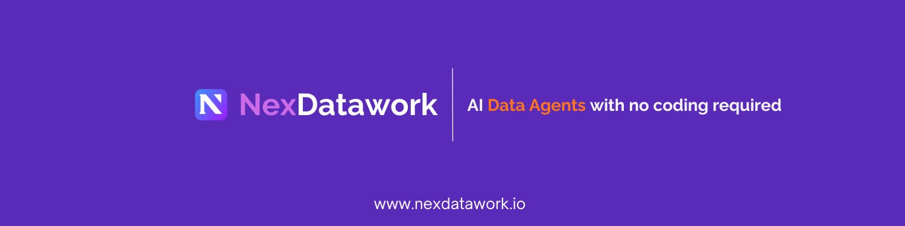

<p align="center">
  
</p>

<div align="center">

 <h1 style="margin-bottom:0; border-bottom:none;">
   <a href="https://www.nexdatawork.io/blank">
     NexDatawork
   </a>
 </h1>

 <h2 style="margin-top:0;">
   An AI tool for data analysis without writing code
 </h2>

 <div align='center'>
 <a href="https://github.com/NexDatawork/data-agents/pulls"></a> 
 <a href="https://github.com/NexDatawork/data-agents/blob/main/LICENSE"></a> 
 <a href = "https://discord.gg/Tb55tT5UtZ"></a>
 <a href="https://github.com/NexDatawork/data-agents/stargazers"></a>


 </div>

</div>
A data agent designed for data analysis specified for particular tasks, quick visualisation and built for adapting for specific requirenments.

## Prerequisites
 * [Node.js](https://nodejs.org/en)
 
 In order to run the programme Supabase and OpenAI API keys are needed.
 
 * [Supabase](https://supabase.com/)
 * [OpenAI](https://platform.openai.com/docs/overview)

## Environment Variables

To run this project, you will need to add the following environment variables to your [.env](.env.example) file

`NEXT_PUBLIC_SUPABASE_URL`

`NEXT_PUBLIC_SUPABASE_ANON_KEY`

`OPENAI_API_KEY`

## Quickstart

In order to start working with the program run the following code:
```bash
git clone https://github.com/NexDatawork/data-agents.git
cd data-agents
cp .env.example .env
```
Fill the URL and APIs in the environment file as shown in the [.env.example](.env.example).

When starting the program for the first time, run this code in your command line:

```bash
npm install
```

Afterwards the programme can be started as follows:
```bash
npm run dev
```

## Table of contents
 * [Features](#features)
 * [Workflow](#workflow)
 * [Results](#results)
 * [License](#license)
 * [Contributing](#contributing)


## <a name='features'></a>Features

 - Display of reasoning
 - Simple Dashboard and Export
 - Seamless workflow set-up
 - Contextual intelligence
 - Chat-bot for refining the results

## <a name='workflow'></a>Workflow

### Create an account
Sign up with your Gmail, Microsoft account or create a new one on the website.
### Upload your data
Choose the **Data Upload** menu and choose a csv file from your computer or drag and drop it in the menu.

### Specify what you expect from the result
In the windows below choose an **industry**, **topic** and **requirenments** for better results. You can add comments in a seperate window.

### Receive the analysed data
In the **Data brain** tab you can see the summary, insights and description of the data.

In the **Dashboard** tab you can see the the graphs of the graphs of some distributions as well as summary.

In the **Chat** tab you can ask the bot about the details of the data.

## <a name='results'></a>Results

After the analysis is completed the results are received in two tabs: **Data Brain** and **Dashboard**.

### Data Brain
General overview of the data is presented as well as the methodology of approaching the dataset which involves:

 * determining missing values and erroneous values as well as analyzing columns
 * determining typical metrics and patterns according to the chosen requirenments
 * analyzing patterns, such as peak values, popular items and more
 * deriving insights from the data
 * creating recommendations

Afterwards, recommendations on possible aspects of the data are generated:
 * recommendations on dealing with missing values
 * recommendations on using trends and prominent items for your advantage
 * recommendations on what data to focus on

Finally, a conclusive overview of the data and statistical insights are presented, such as:
 * Number of total data points
 * Data quality
 * Variable types 
 * Distribution of numerical, categorical and temporal variables with specified columns


### Dashboard

Brief overview of the data with only the most important metrics and figures, such as:
 * file information
 * number of columns of each type (numerical, categorical and temporal)
 * data quality and statistical summary

Brief overview is followed by analysis summary with a rundown of trends needed to derive conclusions from the data based on the user requirenments and recommendations. 

Finally, graphs of the most important variables are presented.

## <a name='contributing'></a>Contributing

## <a name='license'></a>License

This project is licensed under [the Apache-2.0 license](LICENSE).


